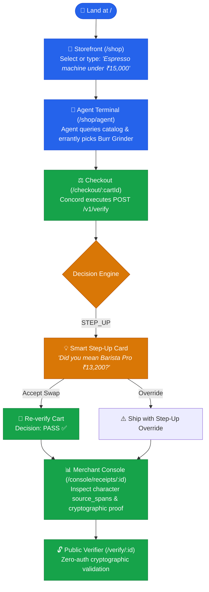
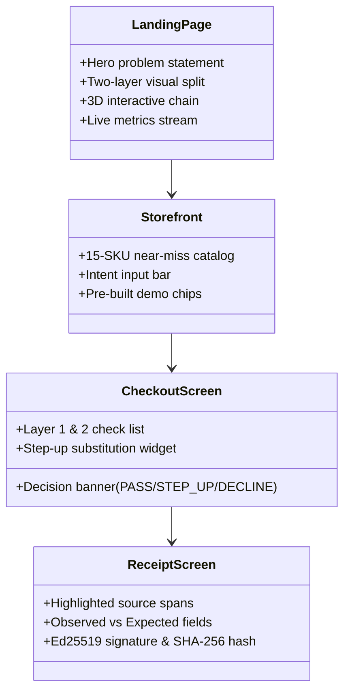

# 🗺️ Application Flow & User Journeys — Concord

| **Specification** | **Target Surfaces** | **UX Model** | **Status** |
|:---:|:---:|:---:|:---:|
| `APP-FLOW-CONCORD` | Web, API, Merchant Console | Funnel + Operational Console | 🟢 **Active** |

---

## 🌐 1. Routing & Surface Taxonomy

Concord defines 11 core routes across its cinematic demo and restrained operational registers:

| Route Path | Page Title | Visual Register | Auth Level | Core Purpose |
|:---|:---|:---:|:---:|:---|
| `/` | **Landing Page** | 🎬 Cinematic | 🔓 Public | High-impact problem visualization & live 3D receipt chain |
| `/shop` | **Storefront** | 🎬 Cinematic | 🔓 Public | 15-SKU catalog with one-click intent demo chips |
| `/shop/agent` | **Agent Run** | 🎬 Cinematic | 🔓 Public | Real-time streaming transcript of agent search & carting |
| `/checkout/:cartId` | **Verification** | ⚖️ Transitional | 🔓 Public | Inline verification outcome, check breakdown & step-up swap |
| `/console` | **Order Feed** | 💼 Restrained | 🔑 API Key | Live stream of verified orders with filterable outcomes |
| `/console/receipts/:id` | **Receipt Detail** | 💼 Restrained | 🔑 API Key | Deep evidence view: spans, raw cart vs structured, Ed25519 proof |
| `/console/metrics` | **Metrics Hub** | 💼 Restrained | 🔑 API Key | Real-time latency percentiles, decision mix, and cache hits |
| `/console/eval` | **Eval Dashboard** | 💼 Restrained | 🔑 API Key | Interactive 60-pair benchmark curves, ablations, and failure log |
| `/console/settings` | **Strictness Dial** | 💼 Restrained | 🔑 API Key | Precision/recall slider projection and API key management |
| `/verify/:receiptId` | **Public Verifier** | 💼 Restrained | 🔓 **None** | Third-party cryptographic audit without exposing PII |
| `/docs` | **API Reference** | 💼 Restrained | 🔓 Public | Interactive Scalar OpenAPI specification |

---

## ⚡ 2. Primary User Journey: The 3-Minute Demo Walkthrough

The demo is optimized for rapid end-to-end evaluation. A reviewer can walk the full loop in under 3 minutes:

---

## 🖥️ 3. Detailed Screen Breakdown

### 🏷️ 3.1 `/` — Cinematic Landing & Live Demo
* **Hero Banner**: High-clarity thesis statement with instantaneous demo CTA.
* **The Failure Revealed**: Visual side-by-side contrast of a traditional AP2 approval vs Concord's semantic catch.
* **3D Hash Ledger**: Interactive Three.js canvas visualizing cryptographic blocks linking in real time.
* **Live Telemetry**: Real-time throughput, recall, and P95 latency pulled from `/v1/metrics/public`.

### 🛒 3.2 `/shop` — Interactive Storefront
* **Intent Bar**: User text entry with 3 pre-built one-click demo scenarios:
  * 🟢 **Pass Case**: *"Espresso machine under ₹15,000, delivered by Friday"* $\to$ Barista Pro (`₹13,200`).
  * 🟡 **Step-Up Case**: *"Espresso machine under ₹15,000"* $\to$ Agent picks Burr Grinder (`₹14,500`).
  * 🔴 **Decline Case**: *"Espresso machine under ₹10,000"* $\to$ Agent picks `₹13,200` machine (exceeds budget).

### 🧾 3.3 `/console/receipts/:id` — The Evidence Inspector
* **1. Header**: Verification verdict, strictness setting, execution latency breakdown.
* **2. Intent Provenance**: Raw intent with interactive, color-coded `source_span` tokens mapped to extracted constraints.
* **3. Cart Breakdown**: Visual differentiation of structured fields verified by Layer 1 vs unvetted prose.
* **4. Check Evidence**: Individual check cards showing observed values, expected boundaries, and plain-English reasons.
* **5. Cryptographic Proof**: Sequence index, `prev_hash`, canonical SHA-256 hash, and Ed25519 digital signature.

---

## 🚦 4. Comprehensive Edge Case Matrix

| Edge Case Scenario | Engine Behavior | UI Presentation | Audit Ledger Record |
|:---|:---|:---|:---|
| **Semantic LLM Timeout / Outage** | Verdict $\to$ `unavailable` $\to$ **`step_up`** | 🟡 Banner: *"Semantic layer unavailable — escalated for review"* | `degraded: true`, receipt logged |
| **Malformed LLM Output** | Parse failure $\to$ **`step_up`** | 🟡 Banner: *"Output unparseable — escalated to human"* | Validator failure code logged |
| **Low Extraction Confidence (<0.6)** | Threshold check $\to$ **`step_up`** | 🟡 *"Could not confidently interpret request"* | Raw confidence recorded |
| **Conflicting Hard Constraints** | Validator check $\to$ **`step_up`** | 🟡 Explains mutual conflict between rules | Conflicting rule IDs recorded |
| **Empty Shopping Cart** | HTTP `400 Bad Request` | 🔴 Error: `EMPTY_CART` | No receipt issued |
| **Currency Mismatch** | HTTP `400 Bad Request` | 🔴 Error: `CURRENCY_MISMATCH` | No receipt issued |
| **Duplicate `Idempotency-Key`** | HTTP `200 OK` (Replay) | 🟢 Returns stored historical receipt | Returns original receipt ID |
| **Reused Key with Modified Body** | HTTP `409 Conflict` | 🔴 Error: `IDEMPOTENCY_KEY_REUSED` | Error logged |
| **Database Connection Failure** | HTTP `503 Service Unavailable` | 🔴 Error: `SERVICE_UNAVAILABLE` | **No unrecorded decision** |

> [!NOTE]
> **The Golden Ledger Rule**: *A decision that was not recorded in the hash-chained database did not happen.* Concord will return an HTTP 503 error before it ever returns an ephemeral, unrecorded verification verdict.

---

  Concord App Flow • Monorepo UX Specification

