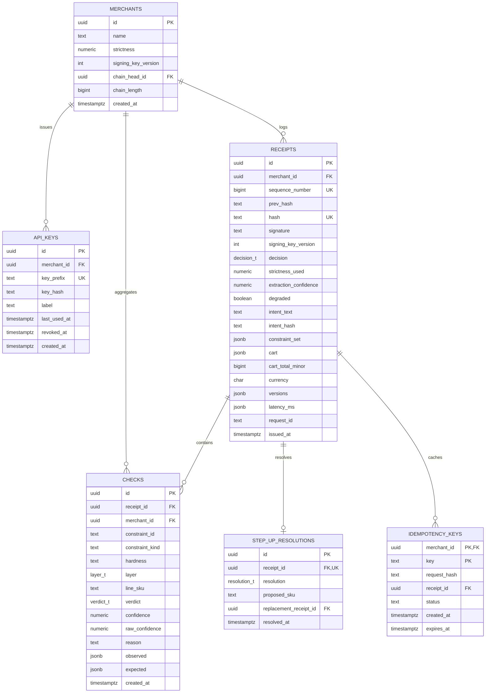
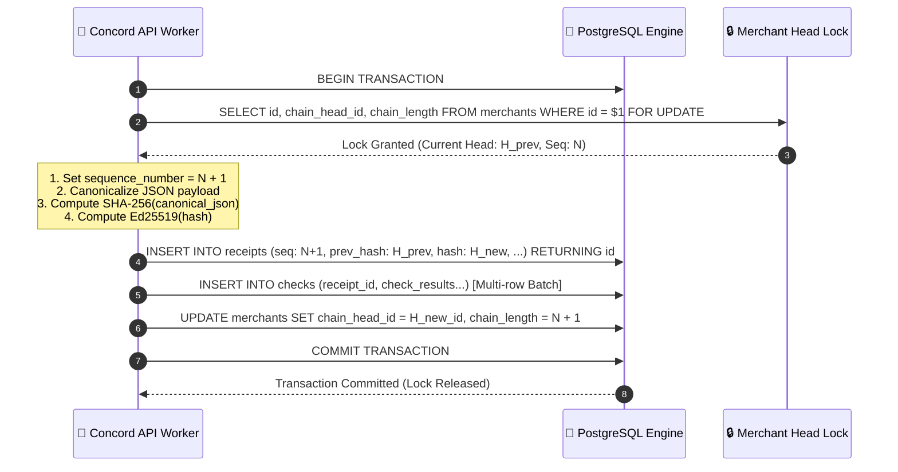

# 🐘 Backend Database Schema & Ledger Architecture — Concord

<div align="center">

| **Database Engine** | **Schema Version** | **Ledger Mode** | **Concurrency Strategy** |
|:---:|:---:|:---:|:---:|
| `PostgreSQL 16+` | `1.0.0` | 🔗 Append-Only Hash Chain | `SELECT ... FOR UPDATE` Row-Level Locks |

---

</div>

## 📐 1. Entity-Relationship Model



---

## 🔒 2. Concurrency Control & The Append Transaction

To guarantee that the cryptographic hash chain **never forks under concurrent requests**, Concord executes all appends inside a serializing transaction:



> [!IMPORTANT]
> **Zero-Fork Guarantee**: The database enforces a `UNIQUE(merchant_id, sequence_number)` constraint. If two concurrent transactions attempt to write the same sequence index, the database rejects the collision immediately.

---

## 📜 3. Data Definition Language (DDL)

### ⚙️ 3.1 Custom Enums & Types
```sql
CREATE TYPE decision_t   AS ENUM ('pass', 'step_up', 'decline');
CREATE TYPE verdict_t    AS ENUM ('pass', 'fail', 'unavailable');
CREATE TYPE layer_t      AS ENUM ('deterministic', 'semantic');
CREATE TYPE resolution_t AS ENUM ('accepted', 'overridden', 'abandoned');
```

### 🏬 3.2 `merchants` Table
```sql
CREATE TABLE merchants (
  id                  UUID PRIMARY KEY DEFAULT gen_random_uuid(),
  name                TEXT NOT NULL,
  strictness          NUMERIC(3,2) NOT NULL DEFAULT 0.75
                        CHECK (strictness BETWEEN 0.50 AND 0.95),
  signing_key_version INT  NOT NULL DEFAULT 1,
  chain_head_id       UUID,                  -- Self-referential FK to receipts(id)
  chain_length        BIGINT NOT NULL DEFAULT 0,
  created_at          TIMESTAMPTZ NOT NULL DEFAULT now()
);
```

### 🔑 3.3 `api_keys` Table
```sql
CREATE TABLE api_keys (
  id           UUID PRIMARY KEY DEFAULT gen_random_uuid(),
  merchant_id  UUID NOT NULL REFERENCES merchants(id) ON DELETE CASCADE,
  key_prefix   TEXT NOT NULL,          -- Indexed prefix (e.g. 'ck_test_a3f9')
  key_hash     TEXT NOT NULL,          -- Argon2id cryptographic digest
  label        TEXT,
  last_used_at TIMESTAMPTZ,
  revoked_at   TIMESTAMPTZ,
  created_at   TIMESTAMPTZ NOT NULL DEFAULT now()
);

CREATE UNIQUE INDEX api_keys_prefix_uq ON api_keys (key_prefix);
CREATE INDEX api_keys_merchant_idx ON api_keys (merchant_id) WHERE revoked_at IS NULL;
```

### 🧾 3.4 `receipts` Table (Append-Only Ledger)
```sql
CREATE TABLE receipts (
  id                    UUID PRIMARY KEY DEFAULT gen_random_uuid(),
  merchant_id           UUID NOT NULL REFERENCES merchants(id),
  sequence_number       BIGINT NOT NULL,

  -- Cryptographic Chain Links
  prev_hash             TEXT,                    -- NULL only for Genesis (seq = 1)
  hash                  TEXT NOT NULL,           -- SHA-256 canonical digest
  signature             TEXT NOT NULL,           -- Ed25519 digital signature
  signing_key_version   INT NOT NULL,

  -- Evaluated Outcomes
  decision              decision_t NOT NULL,
  strictness_used       NUMERIC(3,2) NOT NULL,
  extraction_confidence NUMERIC(4,3) NOT NULL,
  degraded              BOOLEAN NOT NULL DEFAULT FALSE,

  -- Request & Cart Payloads
  intent_text           TEXT NOT NULL,
  intent_hash           TEXT NOT NULL,
  constraint_set        JSONB NOT NULL,
  cart                  JSONB NOT NULL,
  cart_total_minor      BIGINT NOT NULL,
  currency              CHAR(3) NOT NULL,

  -- Provenance Telemetry
  versions              JSONB NOT NULL,   -- {extractor, checker, schema, prompt}
  latency_ms            JSONB NOT NULL,   -- {extract, deterministic, semantic, total}
  request_id            TEXT NOT NULL,

  issued_at             TIMESTAMPTZ NOT NULL DEFAULT now(),

  CONSTRAINT receipts_seq_uq UNIQUE (merchant_id, sequence_number),
  CONSTRAINT receipts_first_link CHECK (
    (sequence_number = 1 AND prev_hash IS NULL) OR
    (sequence_number > 1 AND prev_hash IS NOT NULL)
  )
);

CREATE INDEX receipts_merchant_time_idx ON receipts (merchant_id, issued_at DESC);
CREATE INDEX receipts_decision_idx      ON receipts (merchant_id, decision, issued_at DESC);
CREATE INDEX receipts_intent_hash_idx   ON receipts (intent_hash);
CREATE INDEX receipts_hash_idx          ON receipts (hash);
```

### 🔍 3.5 `checks` Table (Granular Evidence)
```sql
CREATE TABLE checks (
  id             UUID PRIMARY KEY DEFAULT gen_random_uuid(),
  receipt_id     UUID NOT NULL REFERENCES receipts(id) ON DELETE RESTRICT,
  merchant_id    UUID NOT NULL REFERENCES merchants(id),   -- Denormalized for high-speed SQL analytics

  constraint_id   TEXT NOT NULL,
  constraint_kind TEXT NOT NULL,
  hardness        TEXT NOT NULL CHECK (hardness IN ('hard','soft')),
  layer           layer_t NOT NULL,
  line_sku        TEXT,

  verdict        verdict_t NOT NULL,
  confidence     NUMERIC(4,3) NOT NULL CHECK (confidence BETWEEN 0 AND 1),
  raw_confidence NUMERIC(4,3),        -- Pre-Platt scaling value
  reason         TEXT NOT NULL,
  observed       JSONB,
  expected       JSONB,

  created_at     TIMESTAMPTZ NOT NULL DEFAULT now()
);

CREATE INDEX checks_receipt_idx  ON checks (receipt_id);
CREATE INDEX checks_analysis_idx ON checks (merchant_id, constraint_kind, verdict);
```

---

## 🛡️ 4. Immutable Role Grants

```sql
-- Application runtime role
CREATE ROLE concord_app LOGIN PASSWORD :'app_password';

-- Receipts and checks are strictly APPEND-ONLY: NO UPDATE / NO DELETE
GRANT SELECT, INSERT ON receipts, checks TO concord_app;

-- Operational tables permit cleanup
GRANT SELECT, INSERT, UPDATE, DELETE ON extraction_cache, idempotency_keys, rate_limit_buckets TO concord_app;
GRANT SELECT, INSERT, UPDATE ON merchants, api_keys, step_up_resolutions TO concord_app;
```

---

<div align="center">
  <sub>Concord Database Specification • PostgreSQL 16 Append-Only Engine</sub>
</div>