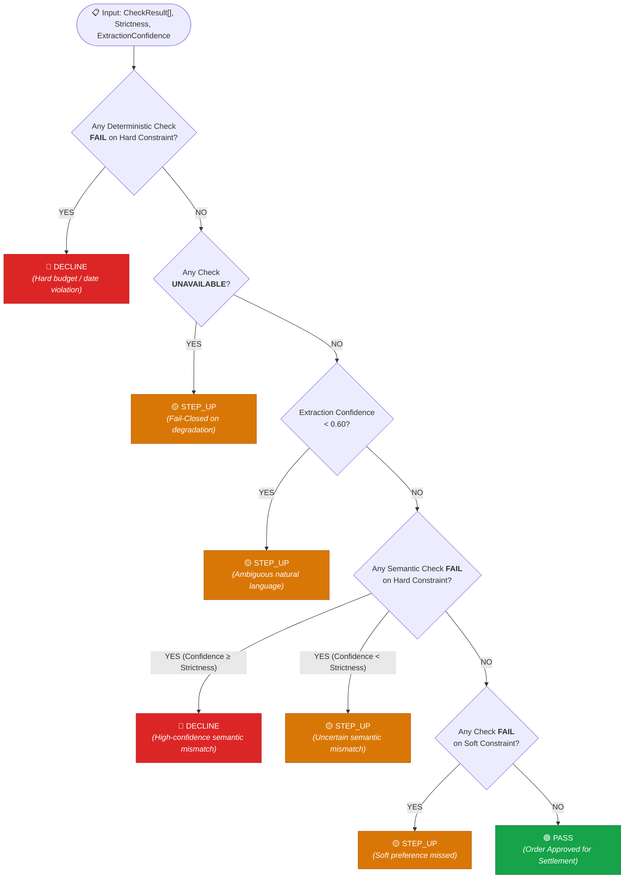

# 📐 Constraint Schema & Decision Algebra — Concord

<div align="center">

| **Engine Module** | **Contract Version** | **Purity Mode** | **Coverage Target** |
|:---:|:---:|:---:|:---:|
| `packages/core` | `v1.0.0` | 🧪 Pure Functions (Zero I/O) | **100% Branch Coverage** |

---

</div>

## 🔄 1. The Pure Domain Pipeline

```mermaid
flowchart LR
    Intent["🔤 Natural Language Intent<br/><i>'espresso machine &lt; ₹15,000'</i>"] -->|extract() + Validator| Constraints["📦 ConstraintSet<br/>• Typed Closed Set<br/>• Character source_spans"]
    
    Cart["🛒 Structured Cart<br/>• SKU, Price, Date<br/>• Brand, Category"] --> Evaluate
    Constraints --> Evaluate
    
    subgraph Evaluation["⚙️ Hybrid Verification Pipeline"]
        direction TB
        L1["🛡️ Layer 1: Deterministic<br/>Arithmetic, Date, Qty, Brand, Refund"]
        L2["🧠 Layer 2: Semantic (Platt Scaled)<br/>Category fit, Attribute conformance"]
    end
    
    Evaluate --> L1 & L2
    L1 & L2 --> Results["📋 CheckResult[]<br/>Observed vs Expected Evidence"]
    
    Results --> Decide["⚖️ Pure Decision Algebra<br/><code>decide(checks, strictness)</code>"]
    Decide --> Outcome["🎯 Outcome: PASS | STEP_UP | DECLINE<br/>+ Ed25519 Signed Receipt"]

    classDef primary fill:#2563eb,stroke:#1d4ed8,color:#ffffff;
    classDef success fill:#16a34a,stroke:#15803d,color:#ffffff;
    classDef warning fill:#d97706,stroke:#b45309,color:#ffffff;
```

---

## ⚖️ 2. The Decision Algebra Tree

The decision engine is evaluated strictly in prioritized order. The first matching condition resolves the terminal outcome:



> [!TIP]
> **Why Deterministic and Semantic Failures Differ**:
> An arithmetic failure (e.g. price cap exceedance) is mathematically incontrovertible and produces an immediate `decline`. A category mismatch is probabilistic; when confidence falls below the merchant's `strictness` threshold, Concord escalates to human `step_up` rather than terminating the sale.

---

## 🏷️ 3. Constraint Taxonomy & Closed Set

<div align="center">

| Kind | Evaluation Layer | Value Type | Scope | Hardness Default | Operational Role |
|:---|:---:|:---:|:---:|:---:|:---|
| `price_max` | 🛡️ Layer 1 | `money` (paise) | `per_unit` | 🔴 `hard` | Prevents overspending beyond authorized cap |
| `price_min` | 🛡️ Layer 1 | `money` (paise) | `per_unit` | 🔴 `hard` | Enforces minimum quality thresholds |
| `quantity` | 🛡️ Layer 1 | `number` | `per_line` | 🔴 `hard` | Prevents volume and bulk drift |
| `delivery_by` | 🛡️ Layer 1 | `date` (ISO 8601) | `total` | 🔴 `hard` | Ensures promised delivery SLA is respected |
| `brand_allow` | 🛡️ Layer 1 | `string_set` | `per_line` | 🔴 `hard` | Enforces explicit brand inclusion lists |
| `brand_deny` | 🛡️ Layer 1 | `string_set` | `per_line` | 🔴 `hard` | Enforces explicit brand exclusion lists |
| `condition` | 🛡️ Layer 1 | `string_set` | `per_line` | 🔴 `hard` | Validates `new` vs `refurbished` vs `used` |
| `refundable` | 🛡️ Layer 1 | `boolean` | `per_line` | 🟡 `soft` | Validates merchant return policy |
| `category` | 🧠 Layer 2 | `text` | `per_line` | 🔴 `hard` | **Core Check**: Ensures correct item type |
| `attribute` | 🧠 Layer 2 | `text` | `per_line` | 🟡 `soft` | Color, material, compatibility, and sizing |

</div>

---

## 💻 4. TypeScript Domain Models

### 📦 4.1 `ConstraintSet`
```ts
export interface ConstraintSet {
  intent_id: string;
  intent_text: string;
  intent_hash: string;                // SHA-256 cache key
  extracted_at: string;               // ISO 8601
  extractor_version: string;          // Bumped on prompt or taxonomy change
  constraints: Constraint[];
  semantic_residue: string | null;     // Unmapped nuance passed directly to Layer 2
  extraction_confidence: number;       // 0.0 - 1.0 (Low score triggers step_up)
}
```

### 🔍 4.2 `Constraint`
```ts
export interface Constraint {
  id: string;                         // e.g. "c_price_max"
  kind: ConstraintKind;
  operator: 'lte' | 'gte' | 'eq' | 'neq' | 'in' | 'not_in' | 'before' | 'after';
  value: ConstraintValue;
  scope: 'per_unit' | 'total' | 'per_line';
  hardness: 'hard' | 'soft';
  source_span: {
    start: number;                    // 0-indexed character offset
    end: number;
    text: string;                     // Verbatim substring from intent
  };
  confidence: number;
}
```

### 📋 4.3 `CheckResult`
```ts
export interface CheckResult {
  check_id: string;
  constraint_id: string;
  layer: 'deterministic' | 'semantic';
  line_sku: string | null;            // null for total-scoped constraints
  verdict: 'pass' | 'fail' | 'unavailable';
  confidence: number;                 // Layer 1 is always 1.0; Layer 2 is Platt-scaled
  reason: string;                     // Plain-English explanation for merchant ops
  observed: unknown;                  // Actual value found in cart
  expected: unknown;                  // Constraint boundary requirement
}
```

---

## 🛡️ 5. Extraction Validation Checklist

Before any check executes, the extracted `ConstraintSet` passes through an invariant validator:

- [x] **Provenance Match**: `source_span.text` must identically match `intent_text[start:end]`.
- [x] **Closed Taxonomy**: `kind` must belong to the approved `ConstraintKind` enum.
- [x] **Type Compatibility**: `operator` must be semantically valid for `value.type` (e.g. `before` only on `date`).
- [x] **Currency Parity**: Constraint currency must match the cart's designated transaction currency.
- [x] **No Mutual Contradictions**: Rejects impossible sets (e.g., `price_min ₹9,000` with `price_max ₹5,000`).

---

<div align="center">
  <sub>Concord Domain Logic • Pure Algebraic Specification</sub>
</div>