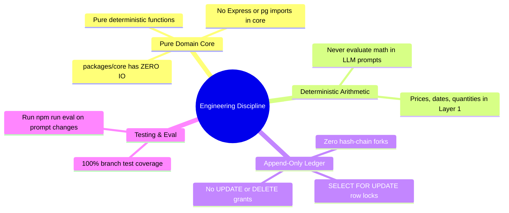

# 🤝 Contributing to Concord

<div align="center">

| **Codebase** | **Architecture** | **Test Coverage Target** | **PR Status** |
|:---:|:---:|:---:|:---:|
| `CONCORD MONOREPO` | Node 22 + TypeScript Strict | **100% Core Branch Coverage** | 🟢 **Open to Contributions** |

---

</div>

Thank you for your interest in contributing to Concord! We maintain high architectural standards to ensure that Concord remains a high-assurance, tamper-evident verification engine for agentic commerce.

---

## 🧭 1. Core Engineering Rules



1. **Pure Domain Core (`packages/core`)**:
   * `packages/core` must **never** import from `apps/`, database drivers (`pg`, `drizzle`), or HTTP frameworks (`express`, `next`).
   * Keep all business domain logic, constraint extraction parsing, check evaluation, and decision algebra strictly pure.
2. **Deterministic Arithmetic First**:
   * Never evaluate price caps, quantities, refundability, or calendar dates inside LLM prompts.
   * All structured constraints must be evaluated in Layer 1 pure functions.
3. **Database Ledger Integrity**:
   * All receipt appends must acquire a row-level lock on the merchant's chain head (`SELECT ... FOR UPDATE`) inside a serializing transaction.
4. **Exhaustive Testing**:
   * Any change to `decide()` or check evaluation functions must maintain **100% branch coverage**.
5. **Evaluation Benchmark Verification**:
   * When modifying prompt templates or constraint extraction schemas, you must run `npm run eval` and confirm no degradation on the 60-pair benchmark.

---

## 🛠️ 2. Local Development Workflow

```bash
# 1. Fork & clone the repository
git clone https://github.com/concord-org/concord.git
cd concord

# 2. Install workspace dependencies
npm install

# 3. Create local environment file
cp .env.example .env

# 4. Build packages
npm run build

# 5. Run database migrations
npm run db:migrate

# 6. Start development servers
npm run dev:api  # Port 3001
npm run dev:web  # Port 3000
```

---

## 🧪 3. Verification Checklist Before Submitting a PR

Before opening a pull request, run the full verification pipeline:

```bash
# 1. Typecheck all packages and apps
npm run typecheck

# 2. Run unit & property test suite
npm run test

# 3. Run the 60-pair ground-truth benchmark
npm run eval

# 4. Run ledger concurrency stress tests
npm run test:concurrency
```

- [x] All TypeScript compilation passes with zero errors under `strict: true`.
- [x] Unit tests in `packages/core` maintain 100% branch coverage.
- [x] `npm run eval` maintains $\ge 85\%$ held-out mismatch recall.
- [x] No sensitive environment variables or secrets leaked in client bundles.

---

<div align="center">
  <sub>Thank you for building the trust layer for agentic commerce! • MIT License</sub>
</div>
