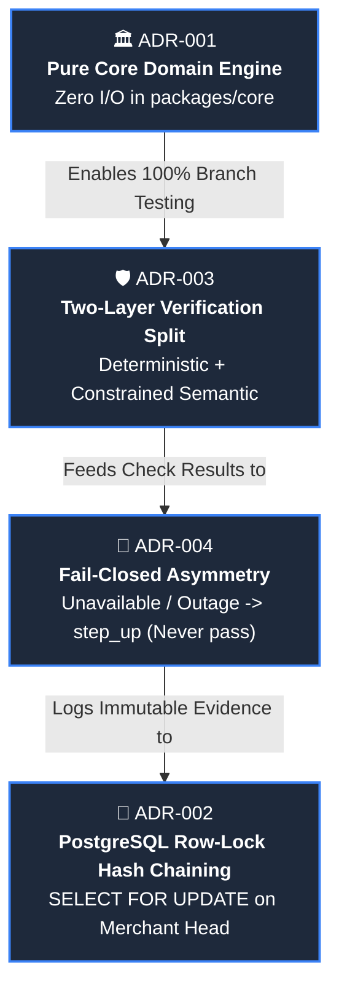

# 🏛️ Architecture Decision Records (ADRs) — Concord

| **Project** | **Status** | **Decision Driver** | **Standard** |
|:---:|:---:|:---:|:---:|
| `CONCORD` | 🟢 **All Approved** | High-Assurance Agentic Commerce | MADR 3.0 |

---

## 🗺️ Architectural Decision Map

---

## 📋 Record Log

### 📌 ADR-001: Pure Domain Verification Engine in `packages/core`

| Status | Date | Impact Area | Decision Owner |
|:---:|:---:|:---:|:---:|
| 🟢 **ACCEPTED** | `2026-08-15` | `packages/core` | Core Architecture Team |

* **Context**: Decision logic and rule evaluations must be 100% reproducible, testable without network mocks, and insulated from HTTP/DB frameworks.
* **Decision**: `packages/core` contains zero framework imports, zero HTTP routing, and zero database drivers. All external I/O (LLM, payments, clock, database) is injected via interfaces.
* **Consequences**:
  * ✅ Enables exhaustive branch testing on `decide()` with sub-millisecond execution.
  * ✅ Zero dependency leakage between web/API and domain logic.
  * ⚠️ Requires adapter wrappers in `apps/api` for external services.

---

### 📌 ADR-002: PostgreSQL Row-Lock Hash Chaining

| Status | Date | Impact Area | Decision Owner |
|:---:|:---:|:---:|:---:|
| 🟢 **ACCEPTED** | `2026-08-16` | `apps/api`, Database | Data & Ledger Team |

* **Context**: Receipts must form an append-only, tamper-evident hash chain per merchant without forking under concurrent verify requests.
* **Decision**: `(merchant_id, sequence_number)` carries a database unique constraint, and appends execute inside a transaction acquiring a row lock (`SELECT ... FOR UPDATE`) on the merchant's chain head.
* **Consequences**:
  * ✅ Zero chain forks under parallel checkout load.
  * ✅ Serialized at the individual merchant level rather than becoming a global system bottleneck.
  * ⚠️ Requires transaction management discipline in database appends.

---

### 📌 ADR-003: Two-Layer Verification Split (Deterministic vs Constrained Semantic)

| Status | Date | Impact Area | Decision Owner |
|:---:|:---:|:---:|:---:|
| 🟢 **ACCEPTED** | `2026-08-18` | `packages/core/checks` | Security & AI Team |

* **Context**: Relying purely on an LLM for price caps and dates introduces latency, prompt injection risks, and non-deterministic arithmetic errors.
* **Decision**: Layer 1 deterministically evaluates structured fields (price, quantity, delivery date, condition, refundability) without reading merchant prose. Layer 2 runs a single bounded LLM call with prompt injection containment and Platt confidence calibration.
* **Consequences**:
  * ✅ Hard budget and delivery checks can **never** be manipulated by malicious product descriptions.
  * ✅ P95 latency for deterministic checks remains under 10ms.
  * ⚠️ Requires structured taxonomy normalization on cart ingestion.

---

### 📌 ADR-004: Fail-Closed Asymmetry for Uncertainty

| Status | Date | Impact Area | Decision Owner |
|:---:|:---:|:---:|:---:|
| 🟢 **ACCEPTED** | `2026-08-20` | `packages/core/decide` | Risk & Safety Team |

* **Context**: How to treat LLM timeouts, schema parse failures, or low extraction confidence in financial settlement paths.
* **Decision**: Any failure or timeout in the semantic evaluation layer produces `unavailable` which maps directly to `step_up` (human confirmation), never `pass`.
* **Consequences**:
  * ✅ Eliminates false approvals in the financial settlement path during outages.
  * ✅ Gracefully degrades to human verification rather than breaking checkout.
  * ⚠️ Requires robust merchant console tooling for step-up resolution.

---

### 📌 ADR-005: Category & Attribute Matching Heuristic Fallback vs Model Wiring

| Status | Date | Impact Area | Decision Owner |
|:---:|:---:|:---:|:---:|
| 🟢 **ACCEPTED** | `2026-09-05` | `packages/core/llm` | AI & Engineering Team |

* **Context**: Operational requirements for offline evaluation, benchmark reproducibility, and demo resilience.
* **Decision**: Category and attribute matching currently uses a keyword-overlap and taxonomy heuristic rather than an active remote LLM call; wiring a real model call (`GoogleGeminiProvider.evaluateSemantic` with XML sandbox containment and strict Zod validation) is implemented and ready for live production environments with active API quotas.
* **Consequences**:
  * ✅ 100% deterministic reproducibility across the evaluation harness without network flake or API quota exhaustion.
  * ✅ Sub-millisecond execution for demo throughput and testing.
  * ⚠️ Remote model inference requires funded API credentials in `.env`.

---

  Concord ADR Log • Maintained under Architectural Governance Guidelines

