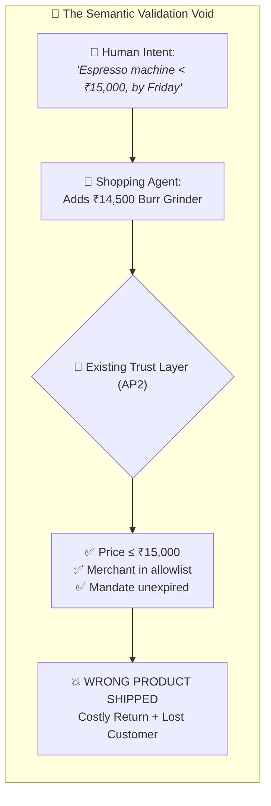
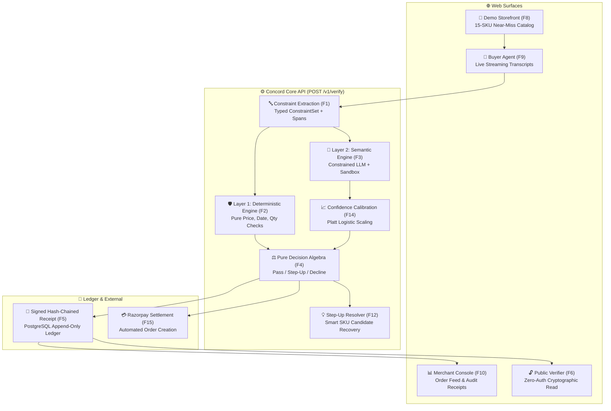

# 📋 Product Requirements Document (PRD) — Concord

| **Document Version** | **Status** | **Target Ship Date** | **Scope** |
|:---:|:---:|:---:|:---:|
| `v1.0.0` | 🟢 **Approved / In Execution** | `2026-09-05` | Agentic Commerce Trust Layer |

---

## 📌 1. Executive Summary

**Concord** is a high-throughput, low-latency **verification API for agent-placed retail orders**. 

When an AI shopping agent checks out on behalf of a human buyer, existing protocols (such as Google AP2) verify authorization, spending caps, and merchant IDs—**but completely ignore semantic correctness**. Concord solves this by intercepting agent carts prior to merchant fulfillment, parsing natural-language buyer intent into typed provenance constraints, executing a two-layer hybrid evaluation (deterministic arithmetic + constrained semantic LLM), and issuing an Ed25519-signed, hash-chained receipt.

> [!IMPORTANT]
> **One-Sentence Thesis**:  
> *AP2 proves a human authorized an agent. Nobody checks if the agent bought the right thing — Concord does, before the merchant ships.*

---

## 🎯 2. The Core Problem

AI-driven commerce is experiencing exponential growth, but the infrastructure for semantic validation is broken:

### 📉 Why This Matters Commercially
* **Channel Growth**: AI-driven retail traffic grew ~393% YoY into Q1 2026 and converts significantly higher than search traffic.
* **The Merchant Dilemma**: Merchants are forced to choose between accepting all agent traffic (absorbing 15–25% return rates due to agent hallucinations) or aggressively throttling AI buyers (forfeiting a prime revenue stream).
* **The Concord Solution**: Concord enables merchants to safely accept agent traffic by intercepting mismatches at checkout and converting potential returns into instant **"Did you mean X?"** confirmation flows.

---

## 👥 3. Target User Personas

| Persona | Role | Primary Objective | Key Requirements |
|:---|:---|:---|:---|
| 🛠️ **Merchant Backend Engineer** | Core Integration Lead | Embed Concord into checkout pipeline | Single idempotent `POST /v1/verify` endpoint, sub-800ms P95 latency, predictable error codes |
| 📊 **Merchant Ops & Risk Analyst** | Day-to-Day Operations | Monitor order feed & resolve escalations | Plain-English explanations, audit receipts with character-level `source_span` highlights |
| 🤖 **AI Agent Developer** | Buying Agent Creator | Build resilient shopping bots | Clear failure classifications to enable programmatic self-correction |
| 🔍 **External Auditor / Reviewer** | Third-Party Evaluator | Audit cryptographic proofs | Zero-auth public verification endpoint (`/v1/receipts/:id/verify`) without PII exposure |

---

## 🏆 4. Product Goals & Non-Goals

### 🎯 Product Goals
* **[G1] Semantic Catch Rate**: Intercept $\ge 85\%$ of semantically mismatched agent orders prior to fulfillment.
* **[G2] Fail-Closed Safety**: Never approve an order under ambiguity or LLM timeout; escalate uncertainty to human step-up.
* **[G3] Cryptographic Auditability**: Produce tamper-evident Ed25519 receipts linked in an unbroken SHA-256 hash chain.
* **[G4] Production Checkout Latency**: Deliver sub-800ms P95 latency overhead on warm cache paths.

### 🚫 Explicit Non-Goals
* ❌ **Not a Fraud Detector**: A mismatched cart is treated as an unintentional mistake, not malicious payment fraud.
* ❌ **Not a Payment Gateway**: Settlement delegates to Razorpay's test-mode API.
* ❌ **Not a Discovery Engine**: Concord does not search external catalogs or act as a shopping recommender.
* ❌ **No Multi-Tenant Complexity**: Single-merchant focus with clean domain boundaries for future extensibility.

---

## 🗺️ 5. Feature Architecture Map

---

## 📦 6. Feature Specifications

### 🟢 Must-Have Core Features (P0)

| ID | Feature Name | Description | Delivery Surface |
|:---:|:---|:---|:---:|
| **F1** | **Constraint Extraction** | Parses natural language intent into a typed, closed-set `ConstraintSet` with character-level `source_span` offsets. Cached by `sha256(intent_text)`. | `packages/core` |
| **F2** | **Deterministic Layer** | Pure-function checks evaluating price caps, quantities, delivery dates, brand allow/deny, condition, and refundability. Reads zero merchant prose. | `packages/core` |
| **F3** | **Semantic Layer** | Single constrained LLM call judging category and attribute fit inside delimited `<untrusted_catalog_data>` XML blocks. | `packages/core` |
| **F4** | **Decision Engine** | Pure function mapping check results into `pass`, `step_up`, or `decline` via a formal, fail-closed algebraic lattice. | `packages/core` |
| **F5** | **Signed Receipt Ledger** | Append-only, hash-chained, Ed25519-signed record stored in PostgreSQL with row-lock serialization. | `apps/api` |
| **F6** | **Public Verifier** | Third-party verification endpoint returning cryptographic proofs without exposing customer PII. | `apps/web` |
| **F7** | **Verification API** | Versioned `POST /v1/verify` endpoint with OpenAPI 3.1 specification, Scalar docs, and idempotency guarantees. | `apps/api` |
| **F8** | **Demo Storefront** | 15-SKU catalog containing deliberate near-miss pairs (e.g., espresso machines vs burr grinders). | `apps/web` |
| **F9** | **Live Buyer Agent** | Orchestrates intent parsing, catalog search, item selection, and cart submission in real-time. | `apps/web` |
| **F10** | **Merchant Console** | Dense operational dashboard featuring live order feeds, per-check evidence inspectors, and latency metrics. | `apps/web` |
| **F11** | **Evaluation Harness** | `npm run eval` test runner executing the 60-pair benchmark and emitting confusion matrices. | `eval/` |

### 🟡 High-Value Enhancements (P1)

| ID | Feature Name | Description |
|:---:|:---|:---|
| **F12** | **Step-Up Resolver** | Re-queries the catalog upon semantic mismatch to suggest conforming replacement SKUs, converting blocks into saved sales. |
| **F13** | **Strictness Control** | Merchant-adjustable threshold ($0.50 - 0.95$) with live precision/recall trade-off projections. |
| **F14** | **Platt Calibration** | 2-parameter logistic scaling mapping raw model confidence to true empirical probabilities. |
| **F15** | **Razorpay Settlement** | Automatic test-mode Order creation upon `pass` verification. |

---

## 📈 7. Success Metrics & KPIs

```mermaid
gantt
    title Key Performance Indicators
    dateFormat  X
    axisFormat %s
    section Recall
    Held-out Mismatch Recall (>= 85%) :active, 0, 89
    section False Positives
    Conforming FP Rate (<= 10%) :active, 0, 3
    section Latency
    Deterministic Layer (<= 50ms) :active, 0, 4
    Total Pipeline Warm (<= 800ms) :active, 0, 210
```

| Category | Metric | Target Threshold | Validation Method |
|:---|:---|:---:|:---|
| **Accuracy** | Overall Held-Out Mismatch Recall | $\ge 85.0\%$ | `npm run eval` on held-out split |
| **Accuracy** | Conforming False-Positive Rate | $\le 10.0\%$ | Ground-truth conforming pairs |
| **Accuracy** | Reason Accuracy on True Positives | $\ge 90.0\%$ | Fired constraint matching expected |
| **Latency** | Deterministic Check P95 | $\le 50\text{ ms}$ | High-precision timer (`performance.now()`) |
| **Latency** | Total End-to-End P95 (Warm Cache) | $\le 800\text{ ms}$ | Benchmark stress suite |
| **Reliability** | Ledger Fork Rate under Concurrency | **0.0% (Zero Forks)** | 20 parallel worker stress test |
| **Coverage** | Core Branch Coverage | **100.0%** | Vitest coverage report |

---

  Concord PRD • Confidential & Proprietary

