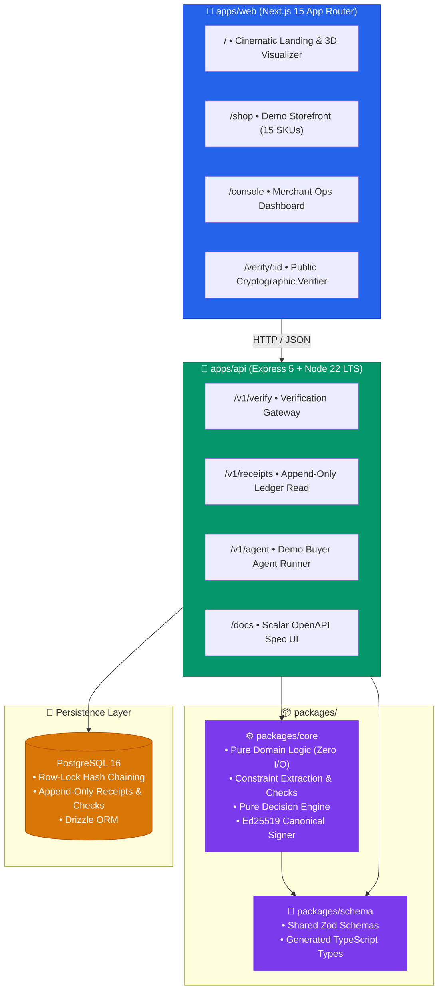
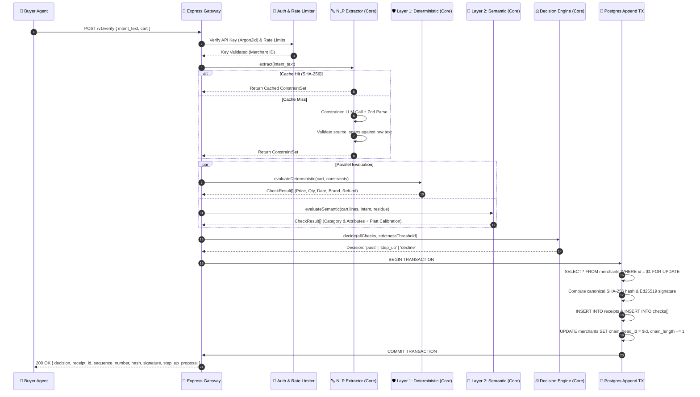
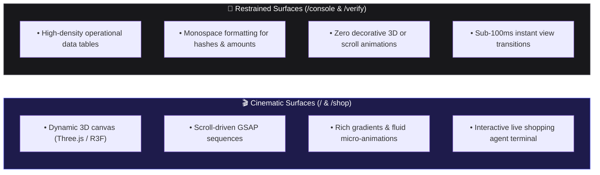
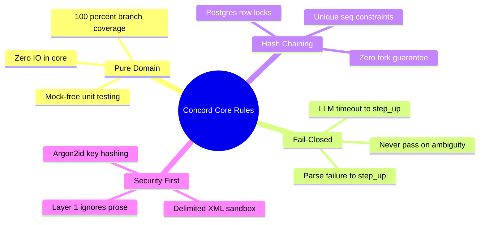

# 🛠️ Technical Requirements Document (TRD) — Concord

| **Specification** | **Version** | **Target Architecture** | **Companion Spec** |
|:---:|:---:|:---:|:---:|
| `TRD-CONCORD` | `v1.0.0` | Node 22 ESM Monorepo + PostgreSQL 16 | [PRD.md](./PRD.md) |

---

## 🏗️ 1. Monorepo Architecture

Concord is structured as an npm workspaces monorepo separating pure computational domain logic from I/O boundaries and presentation layers:

> [!IMPORTANT]
> **The Pure Core Rule**: `packages/core` contains **zero I/O, zero database drivers, zero network imports, and zero framework bindings**. Everything in it is a pure function. All external effects (LLMs, payment gateways, clocks, cryptography keys) are passed via injected dependency interfaces.

---

## 💻 2. Technology Stack Matrix

| Domain | Technology | Version | Rationale & Responsibility |
|:---|:---|:---:|:---|
| **Runtime** | `Node.js` | `22.x LTS` | Native ESM support, high-performance `fetch`, stable crypto APIs |
| **Language** | `TypeScript` | `5.6+` | Strict type safety (`strict: true`), end-to-end schema synchronization |
| **Monorepo** | `npm workspaces` | `10.x` | Zero overhead dependency orchestration and local package linking |
| **Backend API** | `Express` | `5.0+` | Minimalist HTTP routing, predictable middleware lifecycle, low overhead |
| **ORM / Query** | `Drizzle ORM` | `0.33+` | Thin, zero-overhead type-safe SQL queries with automated Drizzle Kit migrations |
| **Database** | `PostgreSQL` | `16+` | Strict transactional guarantees (`SELECT FOR UPDATE`), JSONB document storage |
| **Validation** | `Zod` | `3.23+` | Boundary validation for requests, responses, and LLM structured outputs |
| **API Docs** | `Scalar` + `zod-to-openapi` | Latest | Single source of truth OpenAPI generation directly from Zod schemas |
| **Frontend** | `Next.js` | `15.x` | Modern App Router, server-rendered dashboards, streaming responses |
| **Styling** | `Tailwind CSS` | `v4.0` | High-performance CSS engine with custom utility design tokens |
| **3D & Visuals** | `Three.js` + `R3F` / `GSAP` | Latest | Hardware-accelerated semantic visualizer for hash chain verification |
| **Testing** | `Vitest` | `2.x` | Sub-second unit testing for `core`, isolated integration tests with DB |

---

## ⚡ 3. End-to-End Request Lifecycle

The diagram below traces the execution lifecycle of a single `POST /v1/verify` call:

---

## 🎨 4. The Two Visual Registers

To balance cinematic product presentation with institutional operations reliability, the frontend architecture implements **two distinct design registers**:

> [!TIP]
> **Accessibility & Performance Constraints**:
> * Full support for `prefers-reduced-motion`: all 3D and GSAP animations gracefully collapse to high-contrast static SVGs.
> * WebGL fallback: systems lacking GPU acceleration render clean structural diagrams without layout shifts.
> * Console payload budget: the `/console` bundle excludes Three.js and GSAP entirely for lightning-fast operational loads.

---

## 🔒 5. Core Engineering Principles

* **1. Modularity**: `packages/core` exports pure functions only. External services enter through dependency injection.
* **2. Deterministic Arithmetic**: Prices, dates, and quantities are never trusted to probabilistic models.
* **3. Append-Only Ledger**: Database grants strictly forbid `UPDATE` or `DELETE` on receipts and checks.
* **4. Reproducible Evaluation**: Prompt changes automatically bump `PROMPT_VERSION` and invalidate extraction cache.

---

  Concord Technical Specification • Node 22 & TypeScript 5.6

